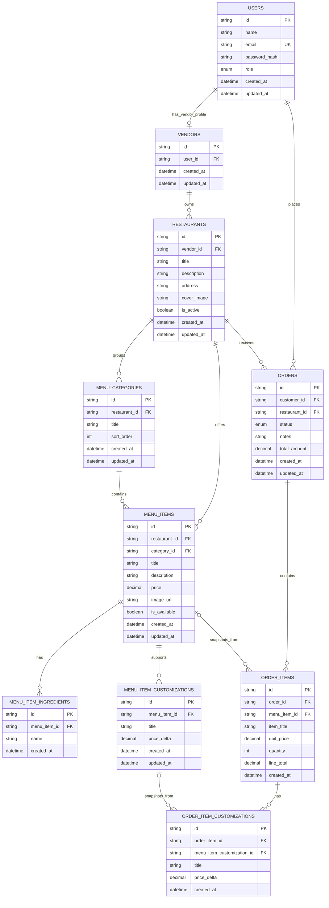

# Luqmah Database ERD

This diagram reflects the current Prisma schema for the local Luqmah backend.

```mermaid
erDiagram
    USERS ||--o| VENDORS : has_vendor_profile
    USERS ||--o{ ORDERS : places
    VENDORS ||--o{ RESTAURANTS : owns
    RESTAURANTS ||--o{ MENU_CATEGORIES : groups
    RESTAURANTS ||--o{ MENU_ITEMS : offers
    RESTAURANTS ||--o{ ORDERS : receives
    MENU_CATEGORIES ||--o{ MENU_ITEMS : contains
    MENU_ITEMS ||--o{ MENU_ITEM_INGREDIENTS : has
    MENU_ITEMS ||--o{ MENU_ITEM_CUSTOMIZATIONS : supports
    ORDERS ||--o{ ORDER_ITEMS : contains
    MENU_ITEMS o|--o{ ORDER_ITEMS : snapshots_from
    ORDER_ITEMS ||--o{ ORDER_ITEM_CUSTOMIZATIONS : has
    MENU_ITEM_CUSTOMIZATIONS o|--o{ ORDER_ITEM_CUSTOMIZATIONS : snapshots_from

    USERS {
        string id PK
        string name
        string email UK
        string password_hash
        enum role
        datetime created_at
        datetime updated_at
    }

    VENDORS {
        string id PK
        string user_id FK
        datetime created_at
        datetime updated_at
    }

    RESTAURANTS {
        string id PK
        string vendor_id FK
        string title
        string description
        string address
        string cover_image
        boolean is_active
        datetime created_at
        datetime updated_at
    }

    MENU_CATEGORIES {
        string id PK
        string restaurant_id FK
        string title
        int sort_order
        datetime created_at
        datetime updated_at
    }

    MENU_ITEMS {
        string id PK
        string restaurant_id FK
        string category_id FK
        string title
        string description
        decimal price
        string image_url
        boolean is_available
        datetime created_at
        datetime updated_at
    }

    MENU_ITEM_INGREDIENTS {
        string id PK
        string menu_item_id FK
        string name
        datetime created_at
    }

    MENU_ITEM_CUSTOMIZATIONS {
        string id PK
        string menu_item_id FK
        string title
        decimal price_delta
        datetime created_at
        datetime updated_at
    }

    ORDERS {
        string id PK
        string customer_id FK
        string restaurant_id FK
        enum status
        string notes
        decimal total_amount
        datetime created_at
        datetime updated_at
    }

    ORDER_ITEMS {
        string id PK
        string order_id FK
        string menu_item_id FK
        string item_title
        decimal unit_price
        int quantity
        decimal line_total
        datetime created_at
    }

    ORDER_ITEM_CUSTOMIZATIONS {
        string id PK
        string order_item_id FK
        string menu_item_customization_id FK
        string title
        decimal price_delta
        datetime created_at
    }
```
